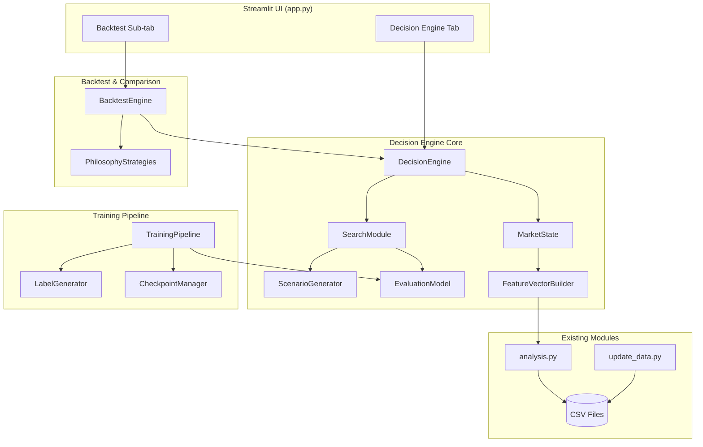
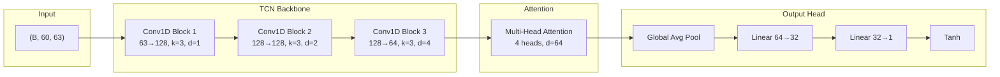
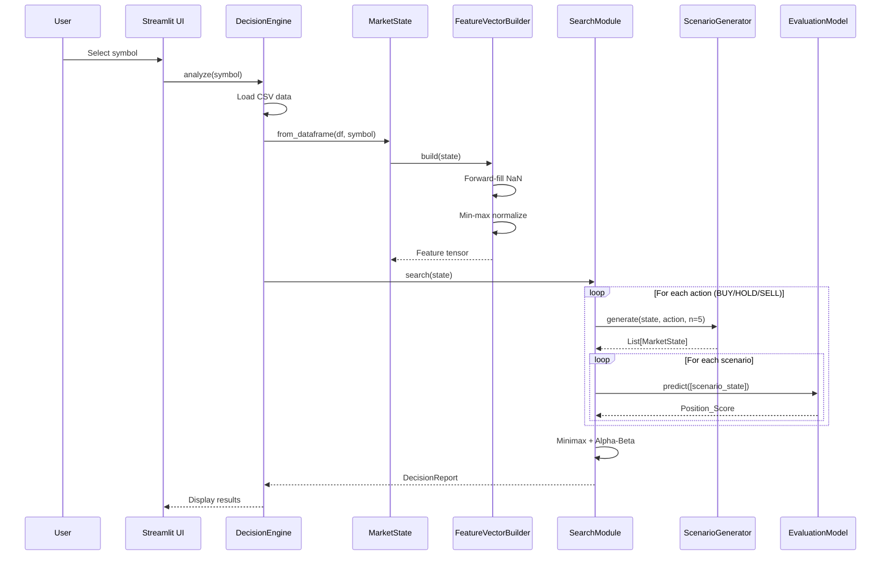

# Design Document: Stock Decision Engine

## Overview

Stock Decision Engine là một module Python tích hợp vào ứng dụng Streamlit hiện tại, kết hợp hai phương pháp ra quyết định giao dịch:

1. **Search-based exploration (Minimax/Alpha-Beta):** Khám phá cây quyết định các kịch bản giá tương lai. "Nước đi" của trader là BUY/HOLD/SELL, "nước đi" của thị trường là các kịch bản giá được sinh ra từ phân bố thống kê. Alpha-Beta pruning giảm số nhánh cần đánh giá.

2. **ML-based evaluation (PyTorch neural network):** Mạng neural đánh giá trạng thái thị trường tại các nút lá của cây tìm kiếm, tương tự hàm evaluation trong chess engine. Chạy hoàn toàn local trên RTX 2060.

Mục tiêu kiến trúc:
- Hoạt động 100% offline sau khi dữ liệu đã tải
- Fit trong 4GB VRAM khi inference, 5.5GB khi training
- Tích hợp seamless với `analysis.py`, `update_data.py`, và `app.py` hiện tại
- Hỗ trợ concurrent training + inference với hot-swap model

## Architecture

### High-Level Architecture



### Module Layout

```
stock/
├── engine/
│   ├── __init__.py
│   ├── decision_engine.py      # DecisionEngine orchestrator
│   ├── market_state.py         # MarketState & FeatureVectorBuilder
│   ├── evaluation_model.py     # PyTorch neural network
│   ├── search_module.py        # Minimax + Alpha-Beta
│   ├── scenario_generator.py   # Statistical scenario generation
│   ├── training_pipeline.py    # Training orchestration
│   ├── backtest_engine.py      # Backtesting framework
│   ├── strategies/
│   │   ├── __init__.py
│   │   ├── base.py             # BaseStrategy ABC
│   │   ├── wyckoff.py          # Wyckoff strategy
│   │   ├── technical.py        # Technical indicator strategy
│   │   ├── momentum.py         # Momentum strategy
│   │   └── mean_reversion.py   # Mean reversion strategy
│   ├── models/                 # Saved model weights & checkpoints
│   └── config.py               # Engine configuration constants
├── ui_decision_engine.py       # Streamlit UI for decision engine
├── analysis.py                 # (existing) Technical indicators
├── market.py                   # (existing) Market data
├── update_data.py              # (existing) Data update
└── app.py                      # (existing, modified) Add new tab
```

### Design Decisions

1. **Separate `engine/` package**: Isolates engine logic from UI. Allows independent testing and keeps existing modules untouched.

2. **Minimax over MCTS**: Minimax with Alpha-Beta is simpler to implement, debug, and reason about with a small branching factor (3-7 scenarios). MCTS would be overkill for this search space.

3. **Statistical scenario generation over GAN/VAE**: Simpler, more interpretable, requires no additional model training. Uses historical return distributions with regime detection.

4. **Single model architecture for all stocks**: The model learns from all VN30 + VNINDEX data jointly. VNINDEX features provide market context. This avoids needing per-stock models.

5. **Chronological train/val/test split**: Prevents future data leakage. Critical for time-series financial data.

## Components and Interfaces

### 1. MarketState

```python
@dataclass
class MarketState:
    symbol: str
    timestamp: pd.Timestamp
    ohlcv: np.ndarray          # shape: (lookback, 5) - OHLCV
    indicators: np.ndarray     # shape: (lookback, num_indicators)
    lookback: int              # default 60, range [20, 200]
    
    def to_feature_vector(self, normalizer: Normalizer) -> np.ndarray:
        """Convert to normalized feature vector for model input."""
        ...
    
    @classmethod
    def from_dataframe(cls, df: pd.DataFrame, symbol: str, 
                       lookback: int = 60) -> 'MarketState':
        """Construct from pandas DataFrame with indicators."""
        ...
    
    def serialize(self) -> bytes:
        """Serialize to bytes for caching/transfer."""
        ...
    
    @classmethod
    def deserialize(cls, data: bytes) -> 'MarketState':
        """Deserialize from bytes."""
        ...
```

### 2. FeatureVectorBuilder

```python
class FeatureVectorBuilder:
    """Converts MarketState into model-ready tensors."""
    
    INDICATOR_COLUMNS: List[str]  # Fixed ordering from analysis.py
    
    def __init__(self, norm_params_path: str):
        self.min_vals: np.ndarray   # per-feature minimums from training
        self.max_vals: np.ndarray   # per-feature maximums from training
    
    def build(self, state: MarketState) -> torch.Tensor:
        """
        Build normalized feature tensor.
        - Forward-fill NaN along time axis
        - Zero-fill remaining NaN
        - Min-max normalize to [0, 1]
        Returns: Tensor shape (1, lookback, num_features)
        """
        ...
    
    def denormalize(self, tensor: torch.Tensor) -> np.ndarray:
        """Inverse normalization for interpretability."""
        ...
    
    def save_params(self, path: str) -> None:
        """Save normalization parameters to JSON."""
        ...
    
    @classmethod
    def from_training_data(cls, dataframes: List[pd.DataFrame]) -> 'FeatureVectorBuilder':
        """Compute normalization params from training data."""
        ...
```

### 3. EvaluationModel

```python
class EvaluationModel(nn.Module):
    """Neural network that scores market states."""
    
    def __init__(self, config: ModelConfig):
        ...
    
    def forward(self, x: torch.Tensor) -> torch.Tensor:
        """
        Input: (batch, lookback, num_features)
        Output: (batch, 1) - Position score in [-1, 1]
        """
        ...
    
    def predict(self, states: List[MarketState], 
                builder: FeatureVectorBuilder) -> List[float]:
        """High-level inference API. Handles batching and device."""
        ...


class ModelManager:
    """Manages model loading, validation, and hot-swap."""
    
    def load(self, path: str) -> EvaluationModel:
        """Load with checksum validation."""
        ...
    
    def hot_swap(self, new_model_path: str) -> None:
        """Atomic model replacement without dropping inference."""
        ...
    
    @property
    def version(self) -> str: ...
    
    @property
    def last_trained(self) -> datetime: ...
```

### 4. SearchModule

```python
class SearchModule:
    """Minimax search with Alpha-Beta pruning."""
    
    def __init__(self, eval_model: EvaluationModel,
                 scenario_gen: ScenarioGenerator,
                 depth: int = 3, timeout: float = 5.0):
        ...
    
    def search(self, state: MarketState) -> DecisionReport:
        """
        Run minimax search from current state.
        Returns best action with full analysis.
        """
        ...
    
    def _minimax(self, state: MarketState, depth: int,
                 alpha: float, beta: float, 
                 is_maximizing: bool) -> float:
        """Recursive minimax with alpha-beta pruning."""
        ...


@dataclass
class SearchNode:
    state: MarketState
    action: Action          # BUY, HOLD, SELL
    score: float
    children: List['SearchNode']
```

### 5. ScenarioGenerator

```python
class ScenarioGenerator:
    """Generates plausible future market scenarios."""
    
    def __init__(self, min_history: int = 30):
        ...
    
    def generate(self, state: MarketState, 
                 action: Action,
                 num_scenarios: int = 5) -> List[MarketState]:
        """
        Generate future states after an action.
        Uses historical return distribution with regime awareness.
        """
        ...
    
    def _estimate_distribution(self, state: MarketState) -> Distribution:
        """Estimate return distribution from recent history."""
        ...
    
    def _apply_action_effect(self, state: MarketState, 
                              action: Action,
                              return_pct: float) -> MarketState:
        """Create new state with projected price movement."""
        ...
```

### 6. TrainingPipeline

```python
class TrainingPipeline:
    """Orchestrates model training."""
    
    def __init__(self, config: TrainingConfig):
        ...
    
    def train_full(self, symbols: List[str], 
                   data_dir: str) -> TrainingResult:
        """Full training from scratch. Target: <4 hours."""
        ...
    
    def train_incremental(self, new_data: Dict[str, pd.DataFrame],
                          checkpoint_path: str) -> TrainingResult:
        """Incremental fine-tuning. Target: <10 minutes."""
        ...
    
    def _generate_labels(self, df: pd.DataFrame, 
                         horizon: int = 5) -> np.ndarray:
        """
        Compute Position_Score targets from future returns.
        Maps % return to [-1, 1] using tanh scaling.
        """
        ...
    
    def _chronological_split(self, data: np.ndarray) -> Tuple:
        """70/15/15 chronological split."""
        ...
```

### 7. BacktestEngine

```python
class BacktestEngine:
    """Simulates trading on historical data."""
    
    def __init__(self, initial_capital: float = 100_000_000,
                 max_position_pct: float = 0.20):
        ...
    
    def run(self, strategy: BaseStrategy,
            df: pd.DataFrame,
            start_date: str, end_date: str) -> BacktestResult:
        """
        Run backtest with Vietnamese market rules:
        - T+2.5 settlement
        - ±7% daily price limits
        - 100-share lot size
        """
        ...
    
    def compare_strategies(self, strategies: Dict[str, BaseStrategy],
                           df: pd.DataFrame,
                           start_date: str, 
                           end_date: str) -> ComparisonResult:
        """Run same backtest across all strategies."""
        ...


@dataclass
class BacktestResult:
    total_return_pct: float
    annualized_return_pct: float
    win_rate: float
    max_drawdown: float
    sharpe_ratio: float
    equity_curve: pd.Series
    trades: List[Trade]
```

### 8. DecisionEngine (Orchestrator)

```python
class DecisionEngine:
    """Main entry point coordinating all components."""
    
    def __init__(self, base_dir: str, config: EngineConfig = None):
        ...
    
    def analyze(self, symbol: str) -> DecisionReport:
        """
        Full analysis pipeline:
        1. Load CSV data
        2. Build MarketState
        3. Run SearchModule
        4. Generate DecisionReport
        """
        ...
    
    def backtest(self, symbol: str, start: str, end: str,
                 initial_capital: float = 100_000_000) -> BacktestResult:
        """Run backtest for a symbol."""
        ...
    
    def compare(self, symbol: str, start: str, end: str) -> ComparisonResult:
        """Compare AI vs philosophy strategies."""
        ...
```

### Key Data Types

```python
class Action(Enum):
    BUY = "BUY"
    HOLD = "HOLD"
    SELL = "SELL"

@dataclass
class DecisionReport:
    symbol: str
    recommended_action: Action
    confidence: float              # [0.0, 1.0]
    position_score: float          # [-1.0, 1.0]
    top_scenarios: List[ScenarioResult]  # Top 3
    top_indicators: List[IndicatorContribution]  # Top 5
    timestamp: datetime

@dataclass
class ScenarioResult:
    action_sequence: List[Action]
    leaf_score: float
    description: str

@dataclass  
class IndicatorContribution:
    name: str
    value: float
    contribution: float  # Absolute contribution to score

@dataclass
class Trade:
    entry_date: pd.Timestamp
    exit_date: pd.Timestamp
    entry_price: float
    exit_price: float
    shares: int
    pnl: float
    pnl_pct: float
```

## Data Models

### Feature Vector Specification

The feature vector is a 3D tensor with shape `(batch, lookback, num_features)`:

| Dimension | Size | Description |
|-----------|------|-------------|
| batch | 1-50 | Number of states evaluated simultaneously |
| lookback | 60 (default) | Historical trading sessions |
| num_features | ~75 | OHLCV (5) + indicators from `analysis.py` (~70) |

**Indicator columns from `analysis.py`** (fixed order):
- Trend (22): EMA_9, EMA_20, EMA_50, EMA_200, SMA_20, SMA_50, MACD, MACD_signal, MACD_hist, ADX, ADX_pos, ADX_neg, Aroon_up, Aroon_down, CCI_20, PSAR, PSAR_up, PSAR_down, Ichimoku_conv, Ichimoku_base, Ichimoku_a, Ichimoku_b
- Momentum (13): RSI_14, RSI_7, STOCH_k, STOCH_d, StochRSI_k, StochRSI_d, Williams_R, ROC_10, TSI, UO, AO
- Volatility (14): BB_upper, BB_middle, BB_lower, BB_pband, BB_wband, ATR_14, ATR_7, KC_upper, KC_middle, KC_lower, DC_upper, DC_middle, DC_lower, Ulcer_14
- Volume (9): OBV, MFI, CMF, VWAP, ADI, FI, VPT, EOM, NVI

Total features = 5 (OHLCV) + 58 (indicators) = **63 features** per timestep.

Note: PSAR_up and PSAR_down often contain NaN (only one is valid at a time), handled by forward-fill + zero-fill.

### Neural Network Architecture

The model uses a **Temporal Convolutional Network (TCN) + Attention** design, chosen for:
- Efficient GPU utilization on RTX 2060
- Handles variable-length sequences well
- Parallelizable (unlike RNN/LSTM)
- Proven effective for financial time series



**Architecture Details:**

```python
class StockEvalNet(nn.Module):
    """
    TCN + Attention model for market state evaluation.
    
    Parameters: ~180K (well within 4GB VRAM constraint)
    Inference: ~5ms per sample on RTX 2060
    """
    def __init__(self, num_features=63, lookback=60):
        super().__init__()
        
        # TCN backbone with dilated causal convolutions
        self.tcn = nn.Sequential(
            TCNBlock(num_features, 128, kernel_size=3, dilation=1),
            TCNBlock(128, 128, kernel_size=3, dilation=2),
            TCNBlock(128, 64, kernel_size=3, dilation=4),
        )
        
        # Multi-head self-attention
        self.attention = nn.MultiheadAttention(
            embed_dim=64, num_heads=4, batch_first=True
        )
        self.layer_norm = nn.LayerNorm(64)
        
        # Output head
        self.head = nn.Sequential(
            nn.AdaptiveAvgPool1d(1),  # Global average pooling
            nn.Flatten(),
            nn.Linear(64, 32),
            nn.GELU(),
            nn.Dropout(0.1),
            nn.Linear(32, 1),
            nn.Tanh()  # Output in [-1, 1]
        )
    
    def forward(self, x):
        # x: (batch, lookback, features)
        x = x.transpose(1, 2)  # (batch, features, lookback) for Conv1D
        x = self.tcn(x)         # (batch, 64, lookback)
        x = x.transpose(1, 2)  # (batch, lookback, 64) for attention
        
        attn_out, _ = self.attention(x, x, x)
        x = self.layer_norm(x + attn_out)  # Residual connection
        
        x = x.transpose(1, 2)  # (batch, 64, lookback) for pooling
        return self.head(x)     # (batch, 1)


class TCNBlock(nn.Module):
    """Temporal Convolutional Block with residual connection."""
    def __init__(self, in_ch, out_ch, kernel_size=3, dilation=1):
        super().__init__()
        padding = (kernel_size - 1) * dilation  # Causal padding
        self.conv1 = nn.Conv1d(in_ch, out_ch, kernel_size, 
                               padding=padding, dilation=dilation)
        self.conv2 = nn.Conv1d(out_ch, out_ch, kernel_size,
                               padding=padding, dilation=dilation)
        self.norm1 = nn.BatchNorm1d(out_ch)
        self.norm2 = nn.BatchNorm1d(out_ch)
        self.relu = nn.GELU()
        self.dropout = nn.Dropout(0.1)
        self.residual = nn.Conv1d(in_ch, out_ch, 1) if in_ch != out_ch else nn.Identity()
    
    def forward(self, x):
        res = self.residual(x)
        x = self.relu(self.norm1(self.conv1(x)[..., :x.size(-1)]))  # Trim causal
        x = self.dropout(x)
        x = self.relu(self.norm2(self.conv2(x)[..., :x.size(-1)]))
        x = self.dropout(x)
        return x + res
```

**Memory Budget (RTX 2060 - 6GB VRAM):**

| Component | Inference | Training |
|-----------|-----------|----------|
| Model parameters | ~0.7 MB | ~0.7 MB |
| Optimizer state | - | ~2.1 MB (Adam: 3x params) |
| Activations (batch=50) | ~50 MB | ~200 MB (with gradients) |
| Input tensors | ~5 MB | ~100 MB (larger batches) |
| PyTorch overhead | ~500 MB | ~800 MB |
| **Total** | **~556 MB** | **~1.1 GB** |
| **Budget** | **4 GB** | **5.5 GB** |

Plenty of headroom. The model is intentionally compact.

### Search Tree Structure

```
Root (Current MarketState)
├── Action: BUY
│   ├── Scenario 1 (bullish) → MarketState → evaluate or recurse
│   ├── Scenario 2 (neutral) → MarketState → evaluate or recurse
│   └── Scenario 3 (bearish) → MarketState → evaluate or recurse
├── Action: HOLD
│   ├── Scenario 1 → ...
│   ├── Scenario 2 → ...
│   └── Scenario 3 → ...
└── Action: SELL
    ├── Scenario 1 → ...
    ├── Scenario 2 → ...
    └── Scenario 3 → ...
```

At depth=3, branching=5: `3 × 5 × 3 × 5 × 3 × 5 = 3,375` leaf nodes.
With Alpha-Beta pruning, typically evaluates ~30-50% of nodes (~1,000-1,700 evaluations).

### Scenario Generation Model

The ScenarioGenerator uses a **percentile-based sampling** approach:

1. Compute daily returns for the last N sessions (N ≥ 30)
2. Detect current volatility regime (ATR-based: low/medium/high)
3. Generate scenarios at strategic percentiles of the return distribution:
   - **5 scenarios** (default): P10, P30, P50, P70, P90
   - **3 scenarios** (reduced): P20, P50, P80
   - **7 scenarios** (expanded): P5, P15, P30, P50, P70, P85, P95
4. Apply Vietnamese market constraints: cap at ±7% daily limit
5. Recompute indicators for the new price point

### Training Labels

Labels are generated from future returns:

```python
def generate_label(df: pd.DataFrame, idx: int, horizon: int = 5) -> float:
    """
    Compute training label for position at index idx.
    
    Returns: float in [-1, 1] using tanh scaling.
    """
    if idx + horizon >= len(df):
        return None  # Not enough future data
    
    current_price = df['close'].iloc[idx]
    future_price = df['close'].iloc[idx + horizon]
    pct_return = (future_price - current_price) / current_price
    
    # Scale to [-1, 1] using tanh with sensitivity factor
    # sensitivity=10 means ±10% return maps to ±0.76
    sensitivity = 10.0
    label = np.tanh(pct_return * sensitivity)
    return label
```

### Data Flow




## Correctness Properties

*A property is a characteristic or behavior that should hold true across all valid executions of a system — essentially, a formal statement about what the system should do. Properties serve as the bridge between human-readable specifications and machine-verifiable correctness guarantees.*

### Property 1: Feature vector normalization bounds

*For any* valid MarketState with non-degenerate data (at least one feature has distinct min and max values), the resulting Feature_Vector after min-max normalization SHALL have all values in the closed interval [0.0, 1.0].

**Validates: Requirements 2.4, 8.3**

### Property 2: MarketState serialization round-trip

*For any* valid MarketState object, serializing to bytes and then deserializing SHALL produce a MarketState whose numerical values differ from the original by no more than 1e-9 per field.

**Validates: Requirements 2.5**

### Property 3: Normalize/denormalize round-trip

*For any* valid MarketState and trained normalization parameters, applying normalization (to [0,1]) followed by denormalization SHALL produce indicator values within 0.01% relative tolerance of the originals.

**Validates: Requirements 8.6**

### Property 4: Normalization parameters serialization round-trip

*For any* set of normalization parameters (per-feature min and max values), saving to JSON and loading back SHALL produce numerically identical parameters (within floating-point representation limits of 1e-15).

**Validates: Requirements 8.4**

### Property 5: Model save/load inference consistency

*For any* trained EvaluationModel and any valid Feature_Vector input, saving the model to disk and loading it on the same device type SHALL produce Position_Score outputs within ±1e-6 tolerance of the original model's outputs.

**Validates: Requirements 13.2**

### Property 6: NaN handling produces clean feature vectors

*For any* MarketState where some Technical_Indicator values are NaN, the FeatureVectorBuilder SHALL produce a tensor containing no NaN or Inf values, applying forward-fill along the time axis then zero-fill for remaining gaps.

**Validates: Requirements 2.7, 8.2**

### Property 7: Evaluation model output bounded for any batch size

*For any* batch of 1 to 50 valid Feature_Vector inputs (including edge cases like all-zero tensors), the EvaluationModel SHALL produce output of shape (batch_size, 1) with all values in the range [-1.0, +1.0].

**Validates: Requirements 3.1, 3.5**

### Property 8: Data validation error reporting

*For any* set of required CSV file paths where some files are missing or contain malformed data (missing required columns or insufficient rows), the Decision_Engine SHALL return an error that identifies the specific problematic files and their issues, and the set of reported files SHALL exactly match the set of actual problematic files.

**Validates: Requirements 1.2, 1.4, 1.5**

### Property 9: Lookback window configuration and enforcement

*For any* integer lookback value in [20, 200] with sufficient data (rows >= lookback), MarketState construction SHALL succeed. *For any* lookback value outside [20, 200] OR data with fewer rows than lookback, construction SHALL fail with an appropriate error.

**Validates: Requirements 2.2, 2.6**

### Property 10: Training label generation bounded

*For any* valid OHLCV price series and any horizon value, the generated training labels SHALL all be in the range [-1.0, +1.0], and the mapping SHALL be monotonically increasing with respect to the underlying percentage return.

**Validates: Requirements 6.2**

### Property 11: Chronological split ordering

*For any* time-series dataset, the chronological train/validation/test split SHALL produce sets where every timestamp in the training set is strictly before every timestamp in the validation set, and every validation timestamp is strictly before every test timestamp.

**Validates: Requirements 6.3**

### Property 12: Checkpoint save/resume consistency

*For any* training state at epoch N, saving a checkpoint and then resuming from it SHALL produce a model whose next training step yields the same parameter updates (within floating-point tolerance of 1e-6) as continuing without interruption.

**Validates: Requirements 6.8**

### Property 13: Minimax optimality

*For any* search tree produced by the SearchModule, the recommended Action SHALL have a minimax score greater than or equal to all other root-level Actions' minimax scores. Equivalently, no alternative action should yield a higher worst-case evaluation.

**Validates: Requirements 4.2**

### Property 14: Scenario generation validity

*For any* valid MarketState with at least 30 days of history, the ScenarioGenerator SHALL produce between 3 and 7 scenarios (inclusive), where each scenario's projected price change does not exceed ±7% from the current price, and all generated MarketStates have valid structure. *For any* state with fewer than 30 days of history, scenario generation SHALL reject the request.

**Validates: Requirements 4.6, 4.7, 4.8**

### Property 15: Decision report structural completeness

*For any* successful analysis, the DecisionReport SHALL contain: a non-empty symbol string, a valid Action (BUY/HOLD/SELL), a confidence score in [0.0, 1.0], a position_score in [-1.0, +1.0], exactly 3 top scenarios (or all available if fewer than 3 exist), and exactly 5 top indicators sorted by absolute contribution in descending order.

**Validates: Requirements 5.1, 5.2, 5.3, 5.4, 5.5**

### Property 16: Low confidence HOLD override

*For any* analysis result where the computed confidence score is below 0.3, the recommended Action in the DecisionReport SHALL be HOLD, regardless of the SearchModule's recommended action or the Position_Score.

**Validates: Requirements 5.6**

### Property 17: Backtest trade constraints (Vietnamese market rules)

*For any* backtest execution, ALL executed trades SHALL satisfy: (a) share quantity is a positive multiple of 100, (b) executed price does not exceed ±7% from the reference price of that session, (c) no sell occurs on a position within 2.5 trading days of its purchase, and (d) entry position value does not exceed 20% of portfolio value at time of entry.

**Validates: Requirements 9.2, 9.3, 9.4**

### Property 18: Philosophy strategy signal validity

*For any* valid market data input, each philosophy-based strategy (Wyckoff, Technical, Momentum, Mean Reversion) SHALL produce exactly one Action from {BUY, HOLD, SELL}, and that action SHALL be consistent with the strategy's documented threshold rules applied to the input indicators.

**Validates: Requirements 10.1, 10.2, 10.3, 10.4**

### Property 19: Strategy comparison fairness

*For any* comparison run, ALL strategies (AI + 4 philosophies) SHALL be evaluated on exactly the same date range, same initial capital, same universe of instruments, and same position sizing rules. The date ranges in each strategy's backtest result SHALL be identical.

**Validates: Requirements 10.5**

## Error Handling

### Error Categories and Responses

| Category | Trigger | Response | Recovery |
|----------|---------|----------|----------|
| **Data Missing** | CSV file not found | Error with file path + suggestion to run `update_data.py` | User updates data |
| **Data Malformed** | Missing columns, wrong types | Error identifying file + specific issue | User fixes/re-downloads |
| **Insufficient Data** | < required rows for lookback/training | Error with row count + minimum required | User waits for more data |
| **Model Not Found** | Model weights file missing | Error + prompt to run training | User runs training pipeline |
| **Model Corrupted** | Checksum mismatch | Error indicating corruption | User re-trains or restores backup |
| **Model Incompatible** | Dimension mismatch | Error with version info | User re-trains model |
| **Norm Params Missing** | JSON file not found | Error + abort feature construction | User re-trains model |
| **GPU OOM** | CUDA out of memory | Retry with halved batch (3x), then CPU fallback | Automatic |
| **CPU Fallback Fail** | CPU also OOM or error | Cancel request + error to user | User reduces workload |
| **Search Timeout** | > 5 seconds elapsed | Return best action from deepest complete level | Automatic (graceful degradation) |
| **Low Confidence** | Confidence < 0.3 | Override to HOLD + inform user | Informational |
| **Training Interrupted** | Process killed/crash | Resume from last checkpoint | Automatic on restart |

### Error Propagation Strategy

```python
class EngineError(Exception):
    """Base exception for all engine errors."""
    def __init__(self, message: str, error_code: str, details: dict = None):
        self.message = message
        self.error_code = error_code
        self.details = details or {}

class DataError(EngineError): pass        # Data loading/validation issues
class ModelError(EngineError): pass       # Model load/inference issues  
class ResourceError(EngineError): pass    # GPU/CPU resource issues
class ConfigError(EngineError): pass      # Configuration issues
```

UI layer catches these exceptions and displays user-friendly messages in Vietnamese via `st.error()`.

### Graceful Degradation

1. **GPU unavailable** → CPU inference (slower but functional)
2. **Search timeout** → Partial result from deepest complete level
3. **Some indicators NaN** → Forward-fill + zero-fill, continue
4. **One strategy fails in comparison** → Exclude + notify, continue with others
5. **Incremental training fails** → Keep existing model, log error, retry next session

## Testing Strategy

### Property-Based Testing

**Library:** [Hypothesis](https://hypothesis.readthedocs.io/) for Python

Property-based tests will validate the 19 correctness properties defined above. Each test runs a minimum of 100 iterations with randomly generated inputs.

**Configuration:**
```python
from hypothesis import given, settings, HealthCheck
from hypothesis import strategies as st

@settings(max_examples=100, suppress_health_check=[HealthCheck.too_slow])
```

**Tag format:** Each test is annotated with:
```python
# Feature: stock-decision-engine, Property {N}: {property_text}
```

**Key generators needed:**
- `market_state_strategy()`: Generates valid MarketState objects with random OHLCV data and indicators
- `feature_vector_strategy()`: Generates valid normalized feature tensors
- `ohlcv_dataframe_strategy(min_rows, max_rows)`: Generates valid OHLCV DataFrames
- `normalization_params_strategy()`: Generates valid min/max parameter sets
- `trade_sequence_strategy()`: Generates valid trade sequences for backtest testing

### Unit Tests (Example-Based)

- Model architecture smoke tests (parameter count, device placement)
- Specific signal generation scenarios for each philosophy strategy
- Error handling for specific invalid inputs
- UI rendering tests for decision report display
- Configuration validation edge cases

### Integration Tests

- End-to-end analysis pipeline (CSV → Decision Report)
- Training pipeline with real VN30 data subset
- Concurrent training + inference
- Model hot-swap under load
- GPU memory monitoring during inference/training
- Performance benchmarks (50ms inference, 5s search, 10min incremental training)

### Test Structure

```
tests/
├── property/
│   ├── test_feature_vector_props.py    # Properties 1, 3, 4, 6, 9
│   ├── test_market_state_props.py      # Properties 2, 8
│   ├── test_evaluation_model_props.py  # Properties 5, 7, 10
│   ├── test_search_props.py           # Properties 13, 14, 15, 16
│   ├── test_backtest_props.py         # Properties 17, 18, 19
│   └── test_training_props.py         # Properties 11, 12
├── unit/
│   ├── test_market_state.py
│   ├── test_feature_vector.py
│   ├── test_evaluation_model.py
│   ├── test_search_module.py
│   ├── test_scenario_generator.py
│   ├── test_training_pipeline.py
│   ├── test_backtest_engine.py
│   └── test_strategies.py
├── integration/
│   ├── test_end_to_end.py
│   ├── test_concurrent.py
│   ├── test_performance.py
│   └── test_gpu_resources.py
└── conftest.py                         # Shared fixtures and generators
```
